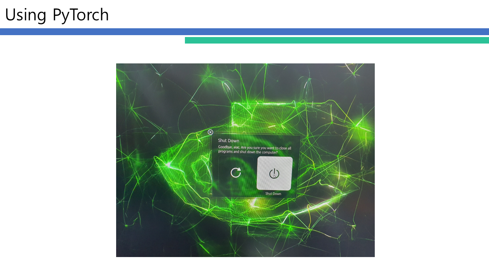

# Running PyTorch Models on Jetson Nano

- **2023-2 고급 컴퓨터 구조 프로젝트** 
- **담당 교수:** 이정근 교수님
---
## 프로젝트 소개
본 프로젝트는 NVIDA의 Jetson Nano 플랫폼을 활용하여 PyTorch 기반 딥러닝 모델을 구동하는 방법을 소개합니다.

Jetson Nano는 작은 크기에도 불구하고 GPU 성능을 제공하는 임베디드 컴퓨팅 보드로, 

실시간 이미지 인식, 객체 탐지, 의미론적 분할 및 포즈 추정 등 다양한 컴퓨터 비전 작업에 적합합니다.

## 발표 자료
**Note: This project was presented in English.**

   

   

   

   

   

   

   

   

   

   

   

   

   

   

   

   

   

   

   

   

   

   

   

   

   

   

   

   

   

   

   

   

   

   

   

   

   

   

   

   

   

   

